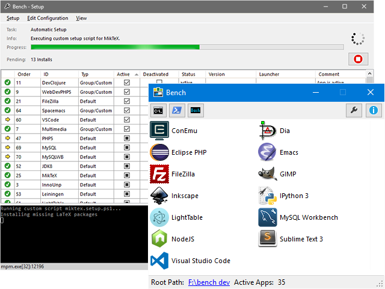

# Bench

[![License][license-img]][license-url]
[![GitHub Release][release-img]][release-url]
[![Github Releases][downloads-img]][downloads-url]
[![GitHub Issues][issues-img]][issues-url]

[][bench-website]

_Portable Environment for Software Development on Windows_

[**Bench Website**][bench-website]

Take a look at the [_About Page_][About] if you want to know why Bench exists.  
Browse through the [_Usage Scenarios_][Scenarios] to learn what Bench can do for you.  
Dive right in, by reading the [_Quickstart_][Quickstart].  
And take a look at the [_App Libraries_][Apps] if you wonder if your favorite tool is already supported by Bench.

## Related Repositories

* [Core App Library](https://github.com/mastersign/bench-apps-core/)
* [Default App Library](https://github.com/mastersign/bench-apps-default/)
* [Development Configuration](https://github.com/mastersign/bench-dev-config)

## License

This project is released under the MIT license.

Copyright © by Tobias Kiertscher <dev@mastersign.de>.

[release-url]: https://github.com/mastersign/bench/releases/latest/
[release-img]: https://img.shields.io/github/release/mastersign/bench.svg?style=flat-square
[downloads-url]: https://github.com/mastersign/bench/releases/latest/
[downloads-img]: https://img.shields.io/github/downloads/mastersign/bench/total.svg?style=flat-square
[license-url]: https://github.com/mastersign/bench/blob/master/LICENSE.md
[license-img]: https://img.shields.io/github/license/mastersign/bench.svg?style=flat-square
[issues-url]: https://github.com/mastersign/bench/issues
[issues-img]: https://img.shields.io/github/issues/mastersign/bench.svg?style=flat-square

[bench-website]: http://mastersign.github.io/bench "Bench Website"
[About]: http://mastersign.github.io/bench/about/
[Scenarios]: http://mastersign.github.io/bench/scenarios/
[Quickstart]: http://mastersign.github.io/bench/start/
[Apps]: http://mastersign.github.io/bench/apps/
