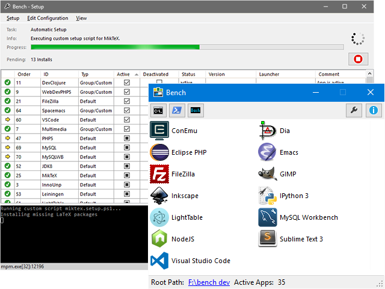

# Bench

[][bench-website]

> Portable Environment for Software Development on Windows

[Bench Website][bench-website] (currently under construction)

## Prerequisites

* Microsoft Windows 7 or higher (Microsoft .NET 4.5 for GUI)
* Internet access for HTTP/HTTPS (possibly via proxy, but without credentials)
* The Windows user account does _not_ need admin priviledges
* A harddrive or a removable drive with at least 2 GB free memory

## Install

* Create a folder on a drive with at least 2 GB space, maybe call it `bench`.
* Save the bootstrap file [bench-install.bat](https://github.com/mastersign/bench/raw/master/res/bench-install.bat)
  inside this folder.
* Run the bootstrap file.
  (You probably have to open the properties dialog for the downloaded file, and allow the execution first.)
* Follow the instructions of the setup wizzard
* Use the setup dialog in _Bench Dashboard_ to activate apps and app groups

## Apps

_Bench_ downloads a selection of commandline tools and applications,
and provides an isolated path environment with all tools available.

Take a look at the [app registry](res/apps.md) to check out the prepared apps.
You can add your own apps to the _Bench_ environment by editing the `apps.md`
in the `config` folder of _Bench_.

## Isolated Environment

The setup process of _Bench_ generates a file which is called `env.cmd`.
This CMD script initializes the execution environment for programs to run inside of _Bench_.

The following environment variables are set by _Bench_:
`BENCH_HOME`, `BENCH_APPS`, `BENCH_PATH`, `BENCH_DRIVE`,
`USERNAME`, `USEREMAIL`, `USERPROFILE`,
`HOME`, `HOMEDRIVE`, `HOMEPATH`,
`APPDATA`, `LOCALAPPDATA`,
`TEMP`, `TMP`, and `PATH`.

## Quickstart with a new Markdown project

If you activated the `Markdown` app group, you can go ahead with these steps:

* Run the `new-project.cmd` action to scaffold a project with [Yeoman]
* Choose the _MdProc_ generator to build a [Markdown] documentation project
* Choose one of the different [Markdown] project templates (`Demo`, `Minimal`, `Personal Log`, ...)
* Follow further instructions
* Take a look at the README file in the scaffolded project

## License

This project is released under the MIT license.

[bench-website]: http://mastersign.github.com/bench "Bench Website"
[Yeoman]: http://yeoman.io "The web's scaffolding tool for modern web apps"
[Markdown]: https://daringfireball.net/projects/markdown/
